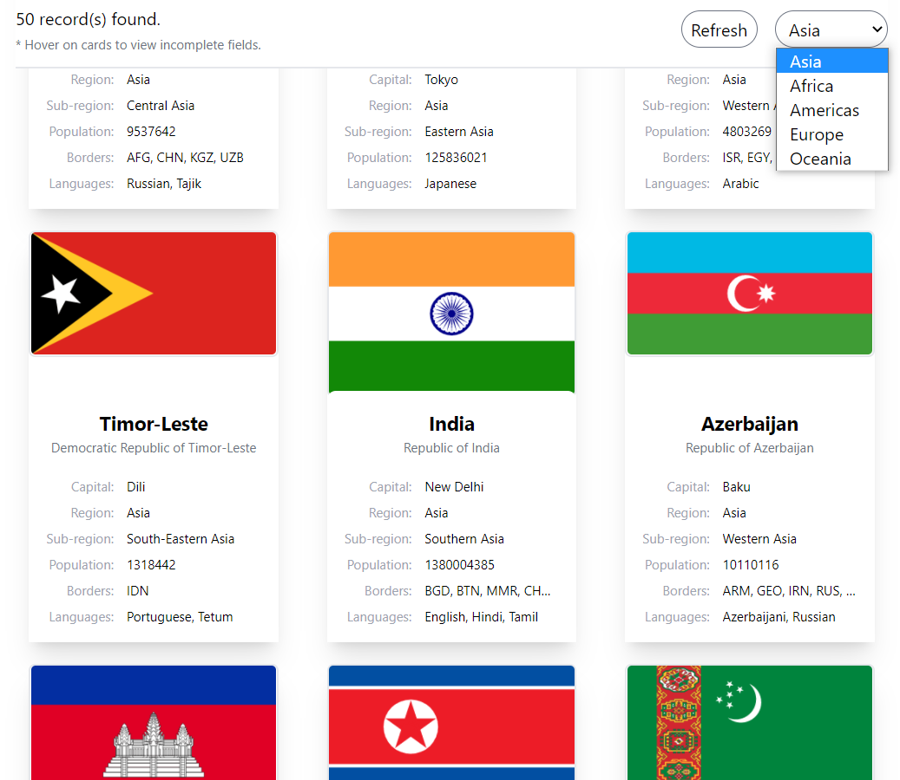

# Countries Application

## Instructions to Run

### 1. Installing the dependencies

Run 'npm install' in the terminal to install the node modules (or dependencies) required.

### 2. Running the application

Run 'npm start' in the terminal.

## Live Demo

You can find the application at the link below:
https://sethi-countries.herokuapp.com

## Screenshots

